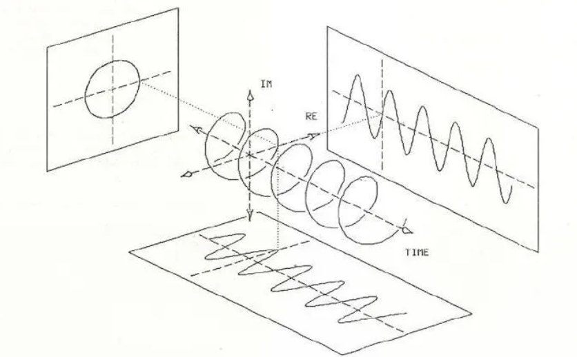

# Visualizing Complex Exponential Signals

Using Euler's formula:

``e^{j*Θ} = cosΘ + jsinΘ``,

we can represent complex exponential signals in Cartesian form

where:
- Θ represents the angle in radians,
- j represents the imaginary unit,
- cos(Θ) represents the Real part,
- jsin(Θ) represents the Imaginary part.

The general form of a complex exponential is given by:
``Z(t) = Ae^{j*Θ}``

``|Z(t)|= A``

Theta can be represented as a sum of a rotation element and a phase element:
`` Θ = ω*t + ɸ ``

where:
- ω represents the angular frequency in radians/second, and determines the pace of the rotation
- t represents time in seconds,
- ɸ represents the phase shift of the signal

Using this knowledge, 
This formula allows us to represent complex exponential signals in terms of sine and cosine functions as projections on the real and imaginary axes vs time.

## visual representation

